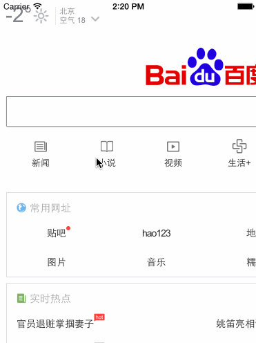

A UIWebView category that can back like Navigator.



##How to use

In your UIViewController

```objective-c
#import "UIWebView+CanBack.h"

- (void)viewDidLoad {
    [super viewDidLoad];
    
    NSURL *url = [NSURL URLWithString:@"http://baidu.com"];
    NSURLRequest *request = [NSURLRequest requestWithURL:url];
    [self.webview loadRequest:request inView:self.view];
}
```

##Author
- Wenxiao Zhang (zhangwenxiao008@163.com)

##License

Distributed under the MIT License